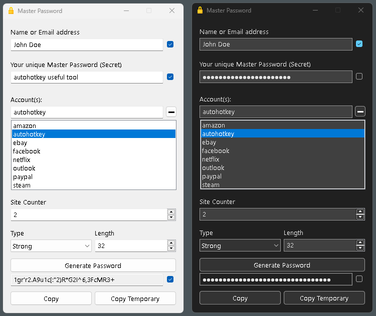

# master-password
[]()
[]()

Master Password is an application that never stores passwords.


## How does it work?

All you need to remember is a username (e.g. your first and last name, an email address or a nickname) and a master password (which should ideally be long and complex).

Then create a list of websites or applications (e.g. mail.google.com, autohotkey.com or steam) for which you want to create a password.

You can decide how complex [[2](#what-differentiates-the-password-complexity-tamplate)] or long [[3](#password-length)] your password for these applications can be.

Then you can copy the password (or temporarily). As soon as you close the application, everything is forgotten except for your list of applications.

No passwords are stored locally or in the cloud.


:bangbang: However, if you forget your username, master password or the optional seed list, you will no longer be able to generate the same passwords.


## Screenshots




## Usage/Examples

To start it, simply call the function MasterPassword()
```autohotkey
MasterPassword()
```

To start the programme with extra protection (seed), specify a path to a file or place a file with the name seed.txt (default) in the same folder
```autohotkey
; checks whether a file with the name 'seed.txt' exists in the same folder.
MsterPassword()

; uses the file 'C:\private\secret.txt' as seed
MasterPassword("C:\private\secret.txt")
```


## Roadmap

- Revision of the GUI

- Add more options

- Make Account List optional

- Show / Hide generated Password


## FAQ

#### Which algorithm is used?

```
master_key    = PBKDF2-SHA512 (user_name, master_password (+ seed) )
site_key      = HMAC-SHA512 ( site_name + site_counter, master_key )
site_password = PW-TAMPLATE ( site_key )
```

### What differentiates the password complexity (tamplate)?
```
Strong -> Are all characters contained in Ascii85 (see https://en.wikipedia.org/wiki/Ascii85)
Medium -> Are all characters contained in Base64  (see https://en.wikipedia.org/wiki/Base64)
PIN    -> Are only numbers from 0 to 9
```

### Password length?
```
The password length can be set for all from 4 to 64.
Strong -> Default = 32
Medium -> Default = 20
PIN    -> Default =  4
```


## Copyright and License
[](LICENSE)


## Donations
[](https://www.paypal.me/smithz)